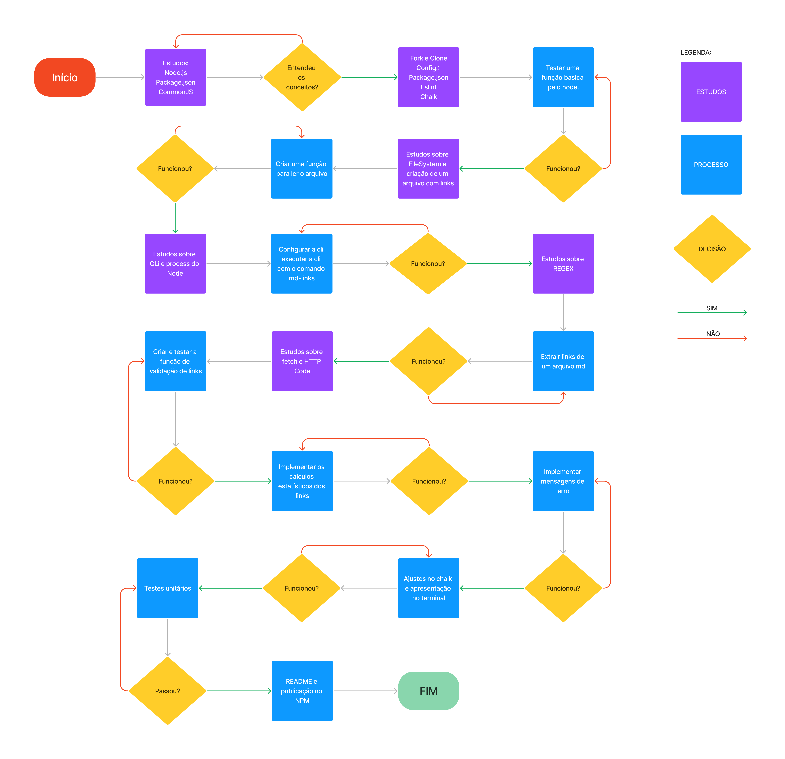
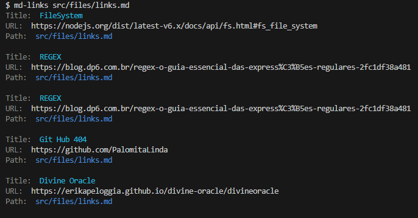
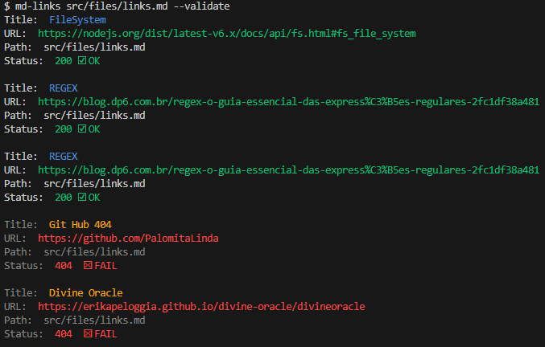
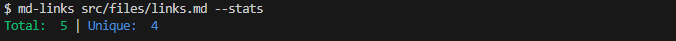
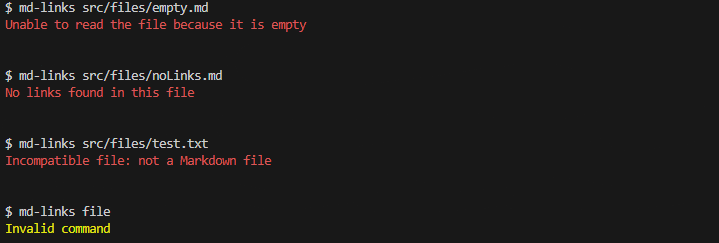
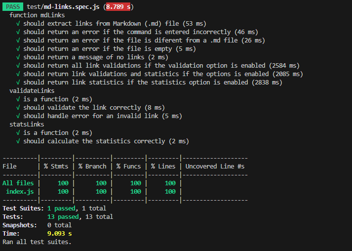

# Markdown Links

## Índice

* [1. Prefácio](#1-prefácio)
* [2. Fluxograma](#2-fluxograma)
* [3. Principais funcionalidades](#3-principais-funcionalidades)
* [4. Guia de instalação e uso](#4-guia-de-instalação-e-uso)
* [5. Testes Unitários](#5-testes-unitários)
* [6. Critérios Mínimos](#6-critérios-mínimos)
* [7. Tecnologias Utilizadas](#7-tecnologias-utilizadas)
* [8. Autora](#8-autora)

***

## 1. Prefácio

[Markdown](https://pt.wikipedia.org/wiki/Markdown) é uma linguagem de marcação
muito popular entre os programadores. É usada em muitas plataformas que
manipulam texto (GitHub, fórum, blogs e etc) e é muito comum encontrar arquivos
com este formato em qualquer repositório, como por exemplo o README.md.
Os arquivos Markdown normalmente contém links que podem estar
quebrados, ou que já não são válidos, prejudicando muito o valor da
informação que está ali.

## 2. Fluxograma

Como este projeto é testado por meio do terminal, desenvolvi um fluxograma para melhor organizar e direcionar cada marco do processo, proporcionando uma visualização mais clara e facilitando a execução de cada etapa.



## 3. Principais funcionalidades

* Leitura e extração de links de um arquivo `Markdown (.md)`;
* Validação dos links com exibição do `HTTP status code` de cada link utilizando a opção `--validate`;
* Dados estatísticos dos links contidos no arquivo .md utilizando a opção `--stats`;
* Combinação de validação (`--validate`) e dados estastíticos dos links (`--stats`) com informações sobre links totais, únicos e quebrados. 
* Mensagens de erro para os comandos executados incorretamente pelos usuários.

## 4. Guia de instalação e uso

### 4.1. Instalação 
Para instalação da biblioteca execute o comando através do terminal:
```
npm install md-links-erika-peloggia
```  

### 4.2. Guia de uso
* Para leitura e extração dos links de um arquivo .md, execute:
```
md-links <caminho-do-arquivo>
```
  


* Para validar links de um arquivo Markdown, execute:
```
md-links <caminho-do-arquivo> --validate
```
  


* Para gerar dados estatísticos dos links contidos no arquivo .md, execute:
```
md-links <caminho-do-arquivo> --stats
```
  


* Para validar links e gerar estatísticas de um arquivo Markdown, execute:
```
md-links <caminho-do-arquivo> --validate --stats
```
  


* Mensagens de erro
Dependendo do comando que o usuário executar no terminal, as seguintes mensagens de erro podem ser geradas:
  * erro para arquivo vazio
  * erro para um arquivo .md sem links
  * erro para a leitura de um arquivo que não é .md
  * erro para um comando inválido

A partir do comando digitado, o terminal poderá retornar os seguintes erros: 



## 5. Testes Unitários

Foram testadas as funções de ``` mdLinks ``` com testes das mensagens de erro, ``` validateLinks ```, ``` statsLinks ```, com 100% de cobertura:  

  

## 6. Critérios Mínimos
* [x] Poder instalar via `npm install`

* [x] Guia de uso e instalação da biblioteca

* [x] Implementa `options.validate`

* [x] Possuir o executável `md-links` no path (configurado no `package.json`)

* [x] Executar sem erros e ter o resultado esperado

* [x] Implementar `--validate`

* [x] Implementar `--stats`

* [x] Os testes unitários devem cobrir no mínimo 70% dos statements, functions, lines e branches.

* [x] Rodar os testes `npm run test`.


## 7. Tecnologias utilizadas

<a href="https://github.com/"></a>
<a href="https://git-scm.com/"></a>
<a href="https://developer.mozilla.org/pt-BR/docs/Web/JavaScript/">
<a href="https://nodejs.org/"></a>
<a href="https://www.npmjs.com/"></a>
<a href="https://www.figma.com/"></a>

## 8. Autora

Erika Peloggia
* GitHub: [@erikapeloggia](https://github.com/erikapeloggia)
* Linkedin: [Erika Peloggia](https://www.linkedin.com/in/erikaakagi)